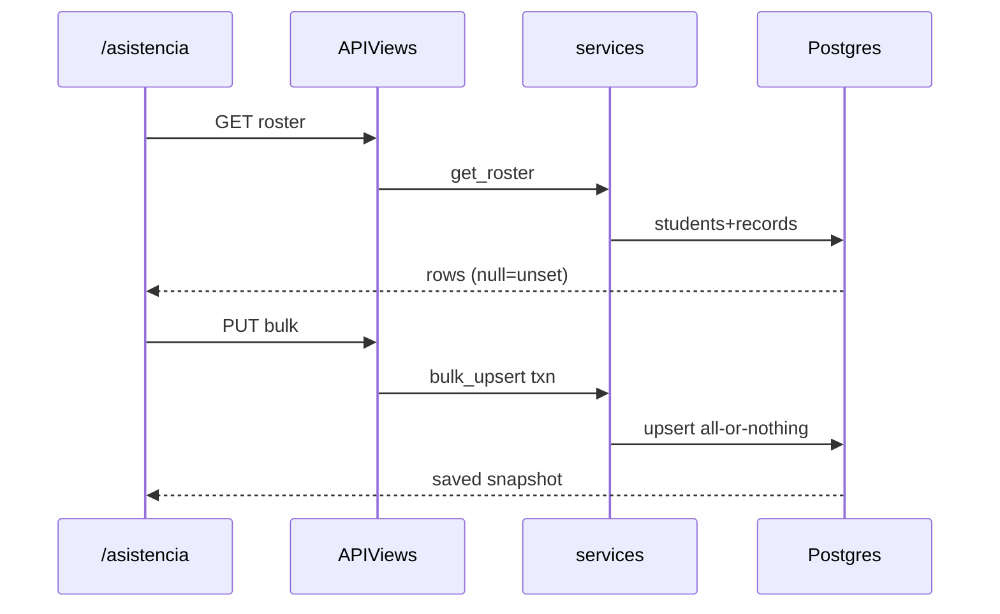

# Design: M7 Daily Attendance

## Technical Approach

New `attendance` app: `AttendanceRecord` (`ScopedModel`) + NULLIF RLS + keyword services +
two `APIView`s (roster GET, atomic bulk PUT). Frontend `/asistencia` follows `LXprh`: local
draft, explicit Guardar, live P/A/R/J counts. Caps: `roster`→`view_workspace`,
`bulk`→`edit_content`. Out: grades, Periodo/`Term`, Exportar, auto-save, page chips.
Delivery: 3 stacked-to-main PRs, ≤400 lines, Strict TDD.

## Architecture Decisions

| Decision | Tradeoff | Choice |
|----------|----------|--------|
| App boundary | Nested in students vs scream | New `attendance` |
| API shape | N×CRUD vs one save | `GET …/roster/` + `PUT …/bulk/` |
| Group on row | FK vs derive | No group FK; validate in bulk |
| Student FK | CASCADE vs PROTECT | PROTECT |
| Uniqueness | +group vs (student,date) | Unique `(student, date)` |
| Date | DateTime vs date-only | `DateField`; client `YYYY-MM-DD` |
| Persist default | Pre-create present vs draft | No row until save; UI default `present` |
| Save UX | Auto-save vs Guardar | Explicit Guardar |
| Periodo/Exportar | Stub vs omit | Omit/disable |
| Concurrency | Version vs LWW | Last-write-wins v1 |
| Views | ViewSet vs APIView | `APIView` + `capability_map` (quizzy) |
| Frame | `y4w3Hb` vs `LXprh` | `LXprh` |
| Tones | New widgets vs extend | Extend `EstadoButton`/`StatCard` |

## Data Model

`AttendanceRecord(ScopedModel)`: `student` FK→Student PROTECT; `date` DateField; `status`
`present|absent|late|excused`; `notes` ≤500 blank; UniqueConstraint(student,date);
`db_table=attendance_attendancerecord`. RLS via `enable_rls_sql` (no GRANT/role).

## Data Flow

```
/asistencia (group from SchoolTeachingContext + local date)
  → GET roster?group&date  [view_workspace] → get_roster merge students+records
  → draft Map (default present); Marcar todos / P/A/R/J / notes local
  → PUT bulk {group,date,entries[]}  [edit_content] → bulk_upsert atomic
  → Postgres RLS NULLIF on attendance_attendancerecord
```



## Interfaces / Contracts

| Endpoint | Cap | Contract |
|----------|-----|----------|
| `GET /api/attendance/roster/` | view_workspace | Query `group`,`date` required; full roster ≤~40; unset `status:null` |
| `PUT /api/attendance/bulk/` | edit_content | `{group,date,entries:[{student,status,notes?}]}`; atomic upsert; reject wrong-group/foreign-ws |

Serializers + spectacular → `schema.yaml` → `npm run gen:api`. Workspace from membership only.

## UI Structure (`LXprh`)

Header (title + context subtitle + Guardar; no Exportar) · Filters (Grupo, Fecha; Periodo
omitted; Marcar todos) · 4 StatCards from draft · DataTable (#, alumno, CURP, EstadoButton
P/A/R/J, observación) · range footer · nav ClipboardCheck→`/asistencia`. Hooks in
`attendance.ts`. Tones: P success `#72E128` · A danger `#FF4D49` · R warning `#FDB528` ·
J info `#26C6F9` (add tokens if missing).

## File Changes

| File | Action | Description |
|------|--------|-------------|
| `backend/attendance/{apps,models,services,serializers,views,urls}.py` | Create | Domain |
| `backend/attendance/migrations/0001_initial.py` + `0002_rls.py` | Create | Table + RLS |
| `backend/attendance/tests/test_{models,services,rls,api}.py` | Create | TDD |
| `backend/config/{settings,urls}.py` | Modify | App + routes |
| `backend/schema.yaml`, `frontend/src/lib/api/schema.d.ts` | Modify | OpenAPI after D2 |
| `frontend/src/lib/api/attendance.ts` | Create | Hooks |
| `frontend/src/app/(app)/asistencia/page.tsx` (+ tests) | Create | Grid |
| `frontend/src/app/(app)/layout.tsx` | Modify | Nav |
| `frontend/src/components/ui/{estado-button,stat-card}.tsx` | Modify | Tones |

## Testing Strategy

| Layer | What | Approach |
|-------|------|----------|
| Unit | Cap deny, wrong-group, atomic upsert | `django_db` services |
| RLS | Cross-ws invisible; empty deny | `_portal_app_connection` |
| API | Roster merge, bulk 200/400, caps | `APIClient` + `X-Workspace-Id` |
| FE | Draft default, Marcar todos, Guardar, counts | Vitest |

## Threat Matrix

N/A — no shell/subprocess/VCS/executable/process boundary; DRF + RLS cover authz.

## Delivery Slices (stacked-to-main)

| PR | Unit | Est. lines | Risk | Rollback |
|----|------|------------|------|----------|
| D1 | Model+RLS+services+unit/RLS tests | ~250–320 | Low | `migrate attendance zero` |
| D2 | Views/urls/config+API tests+schema/gen:api | ~280–360 | Med | Revert routes; keep D1 |
| D3 | Hooks+page+nav+tones+vitest | ~320–400 | High | Remove page/nav; tones additive |

`Decision needed before apply: No` · `Chained PRs recommended: Yes` ·
`400-line budget risk: Medium–High` (split D3 tones if over). One commit/PR; tests with unit.

## Migration / Rollout

Additive reversible migrations; no flag. LWW until versioning follow-up.

## Open Questions

- None — locked by proposal.
