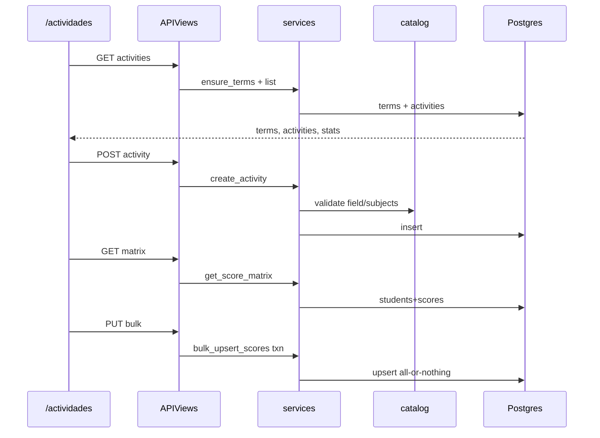

# Design: M7 Actividades (grades)

## Technical Approach

New `grades` app: `Term` + `Activity` + `ActivityScore` (`ScopedModel`) + NULLIF RLS +
keyword services + `APIView`s under `/api/grades/`. FE `/actividades`: toggle, modal
create (immediate), Por alumno draft `Map` + Guardar. Caps: read→`view_workspace`,
write→`edit_content`. Catalog import `lesson_plans.core.catalog` (secundaria).
Calificaciones OUT. Frames `qkWxk`/`CteCl`/`nd704`. D1–D5 stacked-to-main, ≤400, TDD.

## Architecture Decisions

| Decision | Tradeoff | Choice |
|----------|----------|--------|
| App | Nested vs scream | New `grades` |
| Term | Magic int vs entity | `Term(school_year, number∈1..3)` unique |
| Seeding | Admin vs auto | `ensure_terms` → 1–3 on first use |
| Score | 5–10 vs 0–10 | `Decimal(3,1)` `[0.0,10.0]`; null≠0 |
| Subjects | Rows vs one Activity | One row + `subject_ids` JSON; score Activity×Student |
| Catalog | Shared module vs import | Import `lesson_plans.core.catalog`; no tables |
| Tipo | Free vs enum | `task\|activity\|project\|exam` |
| API | CRUD vs bulk | `GET/POST …/activities/`; `GET …/scores/matrix/`; `PUT …/scores/bulk/` |
| Terms URL | Extra vs embed | No `/terms/`; seed in list/create/matrix; return `terms[]` |
| Guardar | Auto vs explicit | Scores draft+Guardar; create immediate |
| Views | ViewSet vs APIView | `APIView` + `capability_map` |
| Modal | Dialog DS vs local | Local `role="dialog"` (contents-picker) |
| Concurrency | Version vs LWW | LWW v1 |
| List size | Paginate vs full | Full client (≤~40; filtered activities) |

## Data Model

`Term`: school_year FK CASCADE; number 1–3; unique(year,number); `grades_term`.
`Activity`: group+term FK PROTECT; title; type; due_date; formative_field_id;
subject_ids JSON; description blank; order due_date; `grades_activity`.
`ActivityScore`: activity+student FK PROTECT; score Decimal(3,1) null; unique(activity,student);
`grades_activityscore`. RLS `enable_rls_sql` on all three.

## Data Flow

```
/actividades (SchoolTeachingContext group; Periodo required)
  → GET activities?group&term&… → ensure_terms + list/stats + terms[]
  → POST activities → catalog validate → create (modal immediate)
  → GET scores/matrix → students × activities; null=unscored
  → draft Map `${student}:${activity}` → PUT bulk atomic upsert (LWW)
```



## Interfaces / Contracts

| Endpoint | Cap | Contract |
|----------|-----|----------|
| `GET …/activities/` | view_workspace | `group`,`term` required; opt `field`,`subject`,`type`,`q`. `{terms,activities,stats}` |
| `POST …/activities/` | edit_content | group,term,title,type,due_date,field,subject_ids[],description?; subjects ⊆ field |
| `GET …/scores/matrix/` | view_workspace | `group`,`term` + filters (no q). `{terms,students,activities,scores[]}` |
| `PUT …/scores/bulk/` | edit_content | `{group,entries:[{student,activity,score\|null}]}`; atomic; reject foreign/OOB |

### Services (D1)

`ensure_terms` · `create_activity` (catalog) · `list_activities` (filters+stats) ·
`get_score_matrix` · `bulk_upsert_scores` (0.0–10.0|null; atomic). Spectacular →
`schema.yaml` → `gen:api` (`schema.d.ts` not authored budget).

## UI Structure

`/actividades` · nav `NotebookPen`. **Por actividad** (`qkWxk`): filters+stats+table+Nueva;
no Guardar. **Por alumno** (`CteCl`): matrix+draft Map+Guardar. **Modal** (`nd704`):
title/tipo/entrega/campo→asignaturas/desc. Banner static. Periodo from `terms[]`.
FE field/subject picks via lesson-plans API.

## File Changes & D1–D5 Ownership

| File | Action | Owner |
|------|--------|-------|
| `backend/grades/{apps,models,services}.py` | Create | D1 |
| `backend/grades/migrations/0001_initial.py` + `0002_rls.py` | Create | D1 |
| `backend/grades/tests/test_{models,services,rls}.py` | Create | D1 |
| `backend/grades/{serializers,views,urls}.py` + `test_api.py` | Create | D2 |
| `backend/config/{settings,urls}.py` | Modify | D2 |
| `backend/schema.yaml`, `frontend/.../schema.d.ts` | Modify | D2 (regen) |
| `frontend/src/lib/api/grades.ts` | Create | D3 |
| `frontend/.../actividades/page.tsx` (+ modal) | Create | D3 list/modal; D4 matrix; D5 polish |
| `frontend/.../actividades/page.test.tsx` | Create | D4 |
| `frontend/src/app/(app)/layout.tsx` | Modify | D3 nav |

## Testing Strategy

| Layer | What | Approach |
|-------|------|----------|
| Unit | ensure_terms, catalog reject, bounds, null≠0, atomic bulk | `django_db` |
| RLS | Cross-ws deny on three tables | `_portal_app_connection` |
| API | list/create/matrix/bulk + caps | `APIClient` + `X-Workspace-Id` |
| FE | toggle, modal, draft Map, Guardar, Periodo | Vitest |

## Threat Matrix

N/A — no shell/subprocess/VCS/executable boundary; DRF+RLS cover authz.

## Delivery Slices (stacked-to-main)

| PR | Unit | Est. | Risk | Rollback |
|----|------|------|------|----------|
| D1 | Models+RLS+services+tests | ~280–360 | Med | `migrate grades zero` |
| D2 | Views/urls/API+schema | ~280–380 | Med | Revert routes; keep D1 |
| D3 | hooks+list+modal+nav | ~300–400 | High | Remove page/nav |
| D4 | matrix+draft+Guardar+vitest | ~280–400 | High | Revert matrix hunk |
| D5 | stats/filters/banner/Periodo | ~150–300 | Med | Revert polish |

`Decision needed before apply: No` · `Chained PRs recommended: Yes` ·
`400-line budget risk: High`. One commit/PR; tests with code.

## Migration / Rollout

Additive reversible migrations+RLS; no flag. LWW until versioning. No Calificaciones.

## Open Questions

- None — seeding/bounds/catalog locked by proposal.
